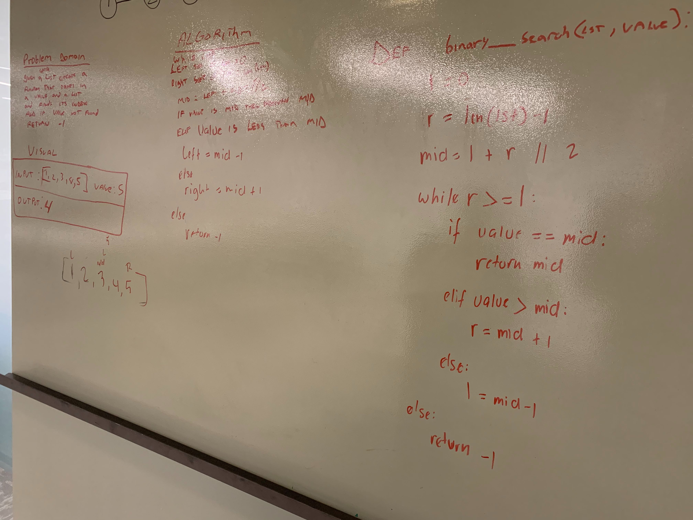

# Array Binary Search
Insert and shift an array in middle at index

## Challenge Description
Write a function called BinarySearch which takes in 2 parameters: a sorted array and the search key. Without utilizing any of the built-in methods available to your language, return the index of the array’s element that is equal to the search key, or -1 if the element does not exist.

## Approach & Efficiency
* initialize `left` as index 0 and `right` at the end of the list `len(list)`
* initialize `middle` by adding `left` to the difference of `right` and `left`, then divide it by 2
* `while loop` if  `right` is greater than or equals to `left`
* check if `middle` element in list is the value, if it is, return `list[middle]`
* if not `middle`, check if value is greater than `middle`, if it is, left will refer to `middle` + 1
* else `right` refers to `middle` - 1 (value lesser than `list(middle)`)
* if none of these conditions are met, return -1

Big O- Log(n)

## Solution

