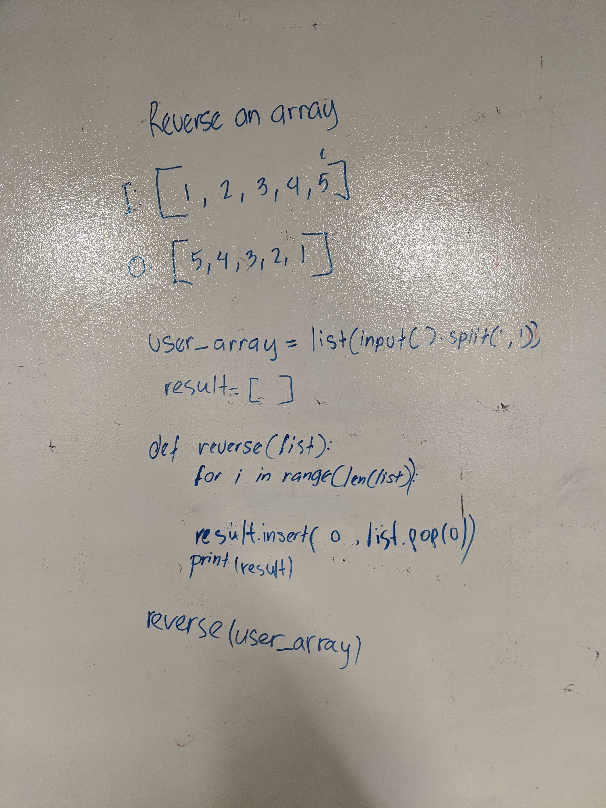

# Reverse an Array

## Challenge
Write a function called reverseArray which takes an array as an argument. Without utilizing any of the built-in methods available to your language, return an array with elements in reversed order.

## Approach & Efficiency
* Created an empty list (result array)
* for loop
* utilized `pop()` to remove the first element in list, and utilized `insert()` to place popped element at the start of the result array of every iteration.

-Linear time; O(n)
Going through every element in array once.

## Solution
