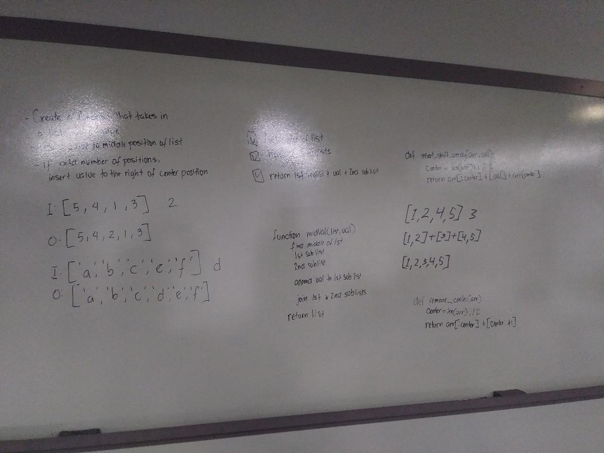

# Insert Shift Array
Insert and shift an array in middle at index

## Challenge Description
Write a function called insert_shift_array which takes in an array and the value to be added. Without utilizing any of the built-in methods available to your language, return an array with the new value added at the middle index.

## Approach & Efficiency
* Find the center
* return 0 index to center + value + center to end of list

O(1) Constant

## Solution
