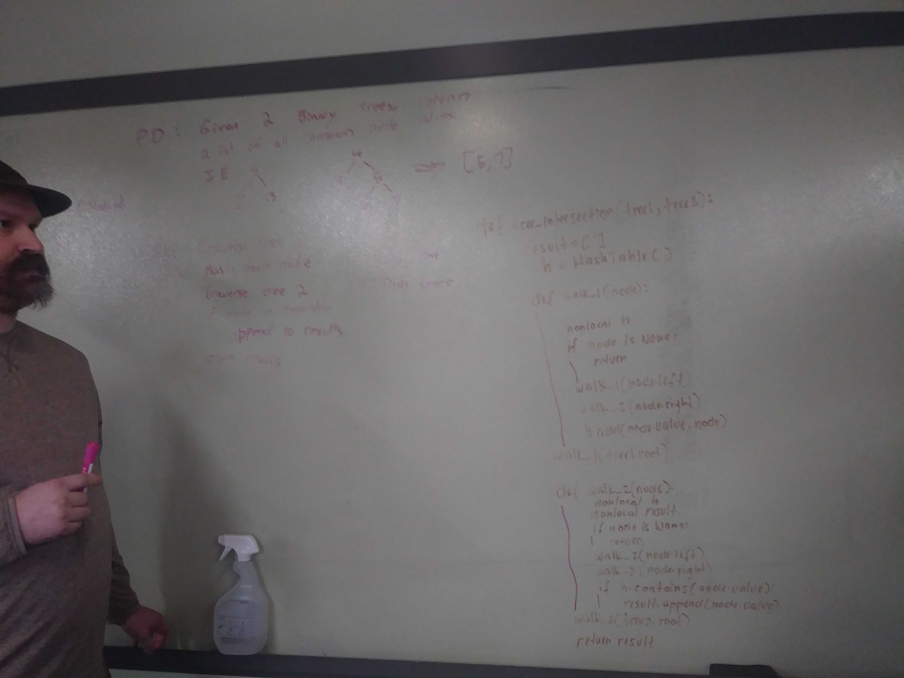

# Tree Intersection
Find common values in 2 binary trees.

## Challenge
* Write a function called tree_intersection that takes two binary tree parameters.
* Without utilizing any of the built-in library methods available to your language, return a set of values found in both trees.

## Approach & Efficiency
* 2 helper functions to traverse both trees
* Utilizing `set()` to add first tree values while travsersing
* Utilized list to push second trees values if it is seen in set
`tree_intersection` - O(n)

## API
