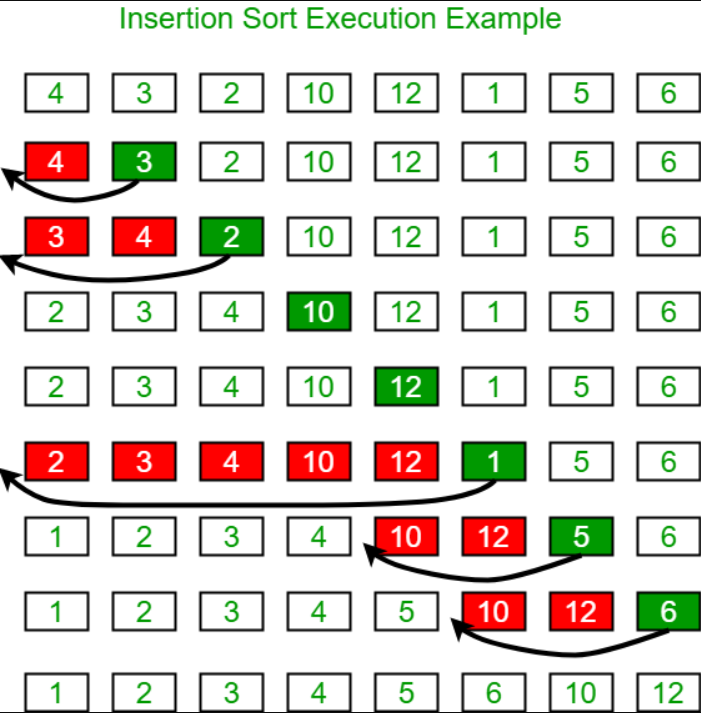

# Blog Notes: Insertion Sort

* Insertion sort is a simple sorting algorithm that builds the final sorted array (or list) one item at a time. It is much less efficient on large lists than more advanced algorithms such as quicksort, heapsort, or merge sort.

* The insertion sort algorithm iterates through an input array and removes one element per iteration, finds the place the element belongs in the array, and then places it there. This process grows a sorted list from left to right.

### Algorithm
* Start by pick the second element in array
* Compare to previous element, and swap if necessary
* Continue to next element, and if it is not in the correct order, iterate though the sorted portion (left side)
* Repeat until array is sorted

#### Properties
* Stable
* O(1) extra space
* O(n2) comparisons and swaps
* Adaptive: O(n) time when nearly sorted
* Worst case: reversed sort

### Pseudocode
`InsertionSort(int[] arr)
  
  FOR i = 1 to arr.length
    int j <-- i - 1
    int temp <-- arr[i]
  
  WHILE j >= 0 AND temp < arr[j]
    arr[j + 1] <-- arr[j]
    j <-- j - 1
    arr[j + 1] <-- temp`
    
### Watch

- [Video](https://www.youtube.com/watch?v=OGzPmgsI-pQ)

### Read

- [Article 1](https://www.geeksforgeeks.org/insertion-sort/)
- [Article 2](https://www.toptal.com/developers/sorting-algorithms/insertion-sort)
- [Article 3](https://www.khanacademy.org/computing/computer-science/algorithms/insertion-sort/a/insertion-sort)
- [Article 4](https://www.toptal.com/developers/sorting-algorithms/insertion-sort)

