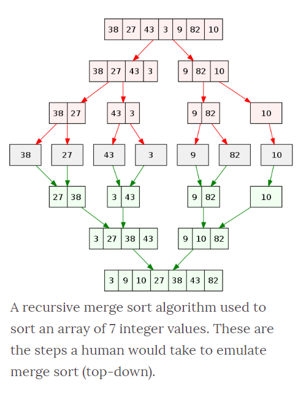

# Blog Notes: Merge Sort
* Merge Sort is a stable sort which means that the same element in an array maintain their original positions with respect to each other.
* Overall time complexity of Merge sort is O(nLogn). It is more efficient as it is in worst case also the runtime is O(nlogn)
* The space complexity of Merge sort is O(n). This means that this algorithm takes a lot of space and may slower down operations for the last data sets.


### Learning Objectives
* To understand to concept of merge sort
* How to implement the code
* Big O 



### Algorithm

* If it is only one element in the list it is already sorted, return.
* Divide the list recursively into two halves until it can no more be divided.
* Merge the smaller lists into new list in sorted order.

### Watch
- [Video 1](https://www.youtube.com/watch?v=4VqmGXwpLqc)
- [Video 2](https://www.youtube.com/watch?v=XaqR3G_NVoo)
- [VIdeo 3](https://www.youtube.com/watch?v=es2T6KY45cA)

### Pseudo

```
ALGORITHM Mergesort(arr)
    DECLARE n <-- arr.length
           
    if n > 1
      DECLARE mid <-- n/2
      DECLARE left <-- arr[0...mid]
      DECLARE right <-- arr[mid...n]
      // sort the left side
      Mergesort(left)
      // sort the right side
      Mergesort(right)
      // merge the sorted left and right sides together
      Merge(left, right, arr)

ALGORITHM Merge(left, right, arr)
    DECLARE i <-- 0
    DECLARE j <-- 0
    DECLARE k <-- 0

    while i < left.length && j < right.length
        if left[i] <= right[j]
            arr[k] <-- left[i]
            i <-- i + 1
        else
            arr[k] <-- right[j]
            j <-- j + 1
            
        k <-- k + 1

    if i = left.length
       set remaining entries in arr to remaining values in right
    else
       set remaining entries in arr to remaining values in left
```

### Read

- [Article 1](https://www.geeksforgeeks.org/merge-sort/)
- [Article 2](https://www.tutorialspoint.com/data_structures_algorithms/merge_sort_algorithm.htm)
- [Article 3](https://www.wikiwand.com/en/Merge_sort)
- [Article 4](https://medium.com/karuna-sehgal/a-simplified-explanation-of-merge-sort-77089fe03bb2)
- [Article 5](https://www.khanacademy.org/computing/computer-science/algorithms/merge-sort/a/overview-of-merge-sort)
