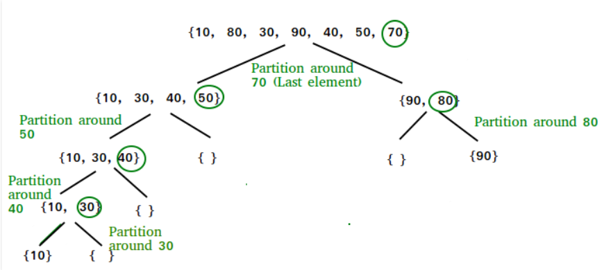

# Blog Notes: Quick Sort
* Like Merge Sort, QuickSort is a Divide and Conquer algorithm. It picks an element as pivot and partitions the given array around the picked pivot. There are many different versions of quickSort that pick pivot in different ways.

* The key process in quickSort is partition(). Target of partitions is, given an array and an element x of array as pivot, put x at its correct position in sorted array and put all smaller elements (smaller than x) before x, and put all greater elements (greater than x) after x. All this should be done in linear time.

### Learning Objectives
* To understand to concept of quick sort
* How to implement the code
* Big O



### Algorithm
* Step-1: You have to pick a pivot. 

* Step-2: Put all the items smaller than the pivot value to the left and larger than the pivot value to the right.

* Step-3:Repeat the step-2 for both left and right side of the pivot (pick a pivot, put all item smaller than the pivot to the left and larger on the right)

### Big O
* Worst Case: O(n2) The worst case occurs when the partition process always picks greatest or smallest element as pivot. The worst case would occur when the array is already sorted in increasing or decreasing order.

* Best Case: The best case occurs when the partition process always picks the middle element as pivot.

### Psuedo Code
```
ALGORITHM QuickSort(arr, left, right)
    if left < right
        // Partition the array by setting the position of the pivot value 
        DEFINE position <-- Partition(arr, left, right)
        // Sort the left
        QuickSort(arr, left, position - 1)
        // Sort the right
        QuickSort(arr, position + 1, right)

ALGORITHM Partition(arr, left, right)
    // set a pivot value as a point of reference
    DEFINE pivot <-- arr[right]
    // create a variable to track the largest index of numbers lower than the defined pivot
    DEFINE low <-- left - 1
    for i <- left to right do
        if arr[i] <= pivot
            low++
            Swap(arr, i, low)

     // place the value of the pivot location in the middle.
     // all numbers smaller than the pivot are on the left, larger on the right. 
     Swap(arr, right, low + 1)
    // return the pivot index point
     return low + 1

ALGORITHM Swap(arr, i, low)
    DEFINE temp;
    temp <-- arr[i]
    arr[i] <-- arr[low]
    arr[low] <-- temp
```

### Readings and References

### Watch
- [Video 1](https://www.youtube.com/watch?v=aXXWXz5rF64)
- [Video 2](https://www.youtube.com/watch?v=ywWBy6J5gz8)

### Read
- [Article 1](https://www.geeksforgeeks.org/quick-sort/)
- [Article 2](https://khan4019.github.io/front-end-Interview-Questions/sort.html#quickSort)
